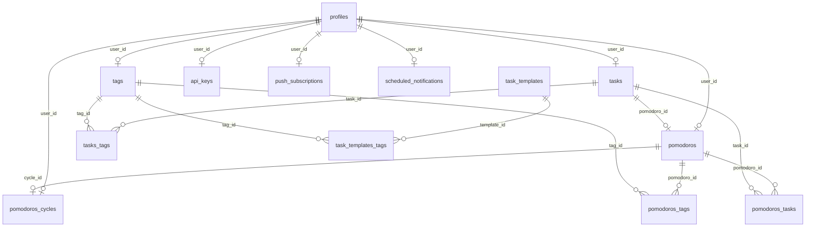

# Yourfocus Project Structure Reference

Este documento contiene la estructura completa de la base de datos Postgres/Supabase y las Edge Functions del proyecto Yourfocus. Ha sido generado para servir como contexto para modelos de IA o como referencia rápida.

## 📊 Arquitectura de Base de Datos (Public Schema)



## 📋 Tablas y Columnas

### `profiles`

_Extensión del perfil de usuario vinculado a `auth.users`._

- **id**: `uuid` (PK, FK `auth.users.id`)
- **username**: `text` (Unique)
- **fullname**: `text`
- **avatar_url**: `text`
- **has_password**: `boolean` (Default: `false`)
- **settings**: `jsonb` (Configuraciones de la app)
- **updated_at**: `timestamptz`

### `tasks`

- **id**: `uuid` (PK)
- **user_id**: `uuid` (FK `auth.users.id`)
- **title**: `text`
- **description**: `text`
- **done**: `boolean` (Default: `false`)
- **stage**: `task_stage` Enum (`backlog`, `to_do`, `in_progress`, `done`, `archived`)
- **tag_id**: `integer` (FK `tags.id`) - _Legacy o primario?_
- **pomodoro_id**: `integer` (FK `pomodoros.id`)
- **archived**: `boolean` (Default: `false`)
- **created_at/updated_at/done_at**: `timestamptz`

### `pomodoros`

- **id**: `bigint` (PK, Identity)
- **user_id**: `uuid` (FK `auth.users.id`)
- **state**: `pomodoro_state` Enum (`current`, `paused`, `finished`, `skipped`, `idle`)
- **type**: `pomodoro_type` Enum (`focus`, `break`, `long_break`)
- **timelapse**: `integer` (Segundos transcurridos)
- **expected_duration**: `smallint` (Default: 1500)
- **cycle**: `bigint` (FK `pomodoros_cycles.id`)
- **started_at/expected_end/finished_at**: `timestamptz`

### `pomodoros_cycles`

- **id**: `bigint` (PK, Identity)
- **user_id**: `uuid`
- **required_tags**: `text[]` (Default: `{focus,break,focus,long_break}`)
- **state**: `pomodoro_state`

### `tags`

- **id**: `bigint` (PK, Identity)
- **user_id**: `uuid`
- **label**: `text`
- **type**: `text`

### `scheduled_notifications`

- **id**: `uuid` (PK)
- **user_id**: `uuid`
- **template_id**: `uuid` (FK `notification_templates.id`)
- **rrule**: `text` (Regla de recurrencia)
- **scheduled_at**: `timestamptz`
- **status**: `text` (`active`, `paused`, `completed`)

---

## 🔒 Row Level Security (RLS) - Resumen

Todas las tablas tienen RLS habilitado. La lógica general es:

- **Propietario**: La mayoría de las tablas (`tasks`, `pomodoros`, `tags`, `api_keys`) restringen el acceso mediante `auth.uid() = user_id`.
- **Perfiles**: `SELECT true` (públicos), `UPDATE auth.uid() = id`.
- **PAT (Personal Access Tokens)**: Las políticas de `tasks` y `pomodoros` incluyen la función `is_valid_personal_access_token()` para validar accesos vía API.
- **Documents**: Solo accesible por `service_role` (usado para embeddings/búsqueda vectorial).

---

## 🌩️ Supabase Edge Functions

| Nombre                   | Slug                   | Verificación JWT | Propósito Estimado                                                   |
| :----------------------- | :--------------------- | :--------------- | :------------------------------------------------------------------- |
| **send-push**            | `send-push`            | ✅ Sí            | Envío de notificaciones Web Push.                                    |
| **process-notification** | `process-notification` | ❌ No            | Procesamiento de cola de notificaciones (activado por cron/webhook). |

---

## 📂 Archivos de Configuración Local

Si necesitas ver el código DDL original y las políticas en detalle, revisa la carpeta:

- `supabase/migrations/`: Contiene la historia de cambios en SQL.
  - `0000_initial.sql`: Esquema base (tablas, enums, RLS inicial).
  - `20260223..._bucket_policies.sql`: Políticas de Storage.
  - `20260224..._scheduled_notifications.sql`: Sistema de notificaciones.

---

## 💡 Tip: ¿Cómo generar esto automáticamente?

Si prefieres un volcado SQL puro (`.sql`) para dárselo a una IA, puedes ejecutar en tu terminal:

```bash
# Para el esquema local (si usas Supabase CLI)
supabase db dump --local > schema.sql

# Para el esquema de producción/remoto
supabase db dump --linked > remote_schema.sql
```
