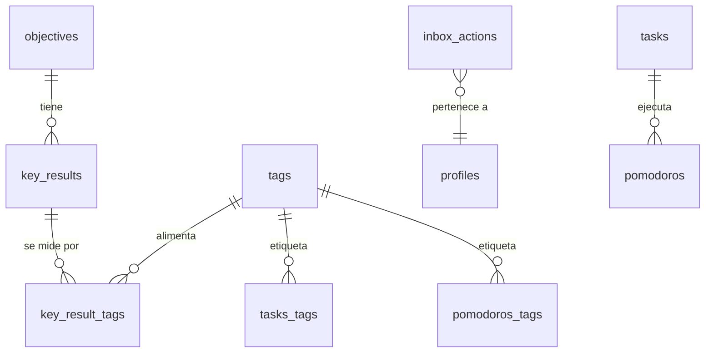

# Feature Template: Single Source of Truth

> Plantilla estratégica basada en el [Paradigma Integrado de Planificación y Diseño](../../convenions/planning_and_design/index.md).
> Cada archivo generado con esta plantilla actúa como **contrato vivo** entre el rol de Product Manager (el "qué" y "por qué") y el rol de Engineer (el "cómo" y "cuánto cuesta").
> Fuentes: [UHRPD.md](./raw_chats/UHRPD.md) | [brainstorming.md](./raw_chats/brainstorming.md) | [bit_context.md](./raw_chats/bit_context.md)

---

## Metadata

| Campo                    | Valor                                                                |
| ------------------------ | -------------------------------------------------------------------- |
| **Feature / Módulo**     | Tag-Based OKRs — Motor del 1% (Kaizen Engine)                        |
| **Estado**               | `Draft`                                                              |
| **Owner**                | Cris (TPM / TPE)                                                     |
| **Dominio (DDD)**        | Gestión de Objetivos / Métricas de Productividad / Intervención TDAH |
| **Módulo (Bounded Ctx)** | Gestión de Objetivos                                                 |
| **Fecha de creación**    | 2026-03-05                                                           |
| **Última actualización** | 2026-03-05                                                           |
| **Sprint / Ciclo**       | Pendiente de planificación                                           |

---

## 1. Capa de Descubrimiento (Contexto de Negocio) — TPM

> **Propósito:** Alineación con el Lean Canvas y el valor para el usuario.
> _Ref: [Paradigma §2 Capa A](../../convenions/planning_and_design/index.md#capa-a-descubrimiento--enfoque-en-el-problema-tpm) + [§9 Features como Mini-Productos](../../convenions/planning_and_design/index.md#9-features-como-mini-productos-lean-canvas-por-feature)_

### User Stories

```
US-01: Como usuario con TDAH,
quiero que mis objetivos se midan automáticamente a través de tags,
para no tener que mantener métricas manualmente y reducir la carga cognitiva.
```

```
US-02: Como usuario con TDAH,
quiero un Inbox que muestre solo una acción a la vez (la de mayor prioridad),
para evitar la parálisis por análisis causada por ver demasiadas notificaciones.
```

```
US-03: Como usuario con TDAH,
quiero que el sistema bloquee tareas mayores a 25 minutos y las desglose con IA,
para forzar la ejecución atómica y prevenir la procrastinación.
```

```
US-04: Como usuario con TDAH,
quiero ver el impacto de cada pomodoro completado en mis OKRs ("sumaste 0.4% a Enfoque Lúcido"),
para obtener feedback inmediato que refuerce el ciclo de ejecución.
```

### Problema a Resolver

El usuario experimenta un **triángulo de parálisis por análisis**:

1. **TDAH** → Alta energía y curiosidad, susceptible a saturación por hiperinformación.
2. **Hiperproductividad como trampa** → Tendencia a diseñar sistemas perfectos en lugar de ejecutar tareas sencillas.
3. **Parálisis por análisis** → Ver muchas notificaciones/tareas equivale a ver ninguna.

**Necesidad central:** Un sistema que reduzca fricción cognitiva, fuerce ejecución atómica, mida progreso automáticamente y persista acciones pendientes.

### KPI / Métricas de Éxito

| Métrica                       | Valor objetivo           | Método de medición                          |
| ----------------------------- | ------------------------ | ------------------------------------------- |
| Incremento diario de enfoque  | ≥ 1% sobre día previo    | `(Pomodoros_Hoy / Pomodoros_Ayer) - 1`      |
| Tareas completadas por día    | ≥ 3 atómicas             | Conteo `tasks` con status `done` diario     |
| Tasa de interacción con Inbox | > 80% acciones resueltas | `completed / (completed + pending)` semanal |
| Uso de atomización IA         | > 50% de tareas > 25min  | Conteo de `AI_ATOMIZE` vs tareas manuales   |

### Contexto Adicional

- **Marco filosófico:** Kaizen (mejora continua del 1%) + Hoshin Kanri (alineación estratégica en cascada desde visión hasta pomodoro).
- **Decisión clave:** Tags sobre Foreign Keys. Las FK obligan a clasificar antes de actuar (alto esfuerzo cognitivo para TDAH). Los tags permiten "lanzar" ideas y que el sistema las organice después.
- **3 Dimensiones de datos existentes:**

| Dimensión        | Entidad            | Qué Mide                    |
| ---------------- | ------------------ | --------------------------- |
| **Tiempo**       | `pomodoros`        | La energía invertida        |
| **Ejecución**    | `tasks`            | La agencia y el avance real |
| **Conocimiento** | Notas Zettelkasten | La curiosidad y retención   |

### Mini Lean Canvas — Tag-Based OKRs

> Vínculo con el [Lean Canvas principal](../../business_model_canvas/lean_canvas.md).

| Sección               | Descripción                                                                               |
| --------------------- | ----------------------------------------------------------------------------------------- |
| **Problema**          | Sobrecarga cognitiva, brecha ejecución-idea, fragmentación de herramientas                |
| **Segmento**          | Desarrolladores autodidactas con TDAH, profesionales en transición, founders técnicos     |
| **UVP**               | "Kaizen-based active knowledge management" — el 1% diario medido automáticamente          |
| **Solución**          | Inbox anti-parálisis + Atomización IA + Tags con pesos + Dashboard del 1%                 |
| **Métricas Clave**    | North Star: Pomodoros/usuario/semana → alimentan KRs automáticamente                      |
| **Ventaja Injusta**   | Ontología de 6 cualidades cognitivas + perfil personalizado por usuario                   |
| **Vínculo al Canvas** | Implementa el UVP, resuelve los 3 problemas top, potencia North Star y Retención M1 > 40% |

---

## 2. Capa de Definición (Requerimientos) — Bridge TPM ↔ TPE

> **Propósito:** Reglas de negocio claras y límites del sistema.
> _Ref: [Paradigma §2 Capa B](../../convenions/planning_and_design/index.md#capa-b-definición--enfoque-en-la-solución-bridge-tpm--tpe)_

### Requerimientos Funcionales (RF)

| ID    | Descripción                                                                                                                                                                                                       | Prioridad |
| ----- | ----------------------------------------------------------------------------------------------------------------------------------------------------------------------------------------------------------------- | --------- |
| RF-01 | **OKRs Tag-Driven:** Los Key Results se miden automáticamente interceptando tags usadas en el día a día. Un Objective tiene múltiples Key Results; cada KR se alimenta de múltiples tags con pesos diferenciados. | Alta      |
| RF-02 | **Inbox de Acciones (Anti-Parálisis):** Tabla tipo Pila (Stack) donde solo se muestra la acción de mayor prioridad. Los ítems no desaparecen hasta interacción: completar, delegar o posponer. Las acciones completadas siguen visibles y pueden re-ejecutarse con confirmación del usuario. | Alta      |
| RF-03 | **Atomización Forzada con IA:** Si una tarea supera 1 Pomodoro (25 min), el sistema bloquea e invoca a la IA para desglosarla en exactamente 3 subtareas de 25 min. Las subtareas heredan los tags del OKR padre. | Alta      |
| RF-04 | **Notificaciones con Action Types opcionales:** Las `scheduled_notifications` incluyen un campo `action_type` configurable (`CREATE_TASK`, `REVIEW_NOTE`, `CREATE_LOG`, `AI_ATOMIZE`, `NONE`). Al dispararse, generan una `inbox_action` con el `action_type` heredado. Si es `NONE`, la notificación es solo informativa. | Alta      |
| RF-05 | **Dashboard del 1% (Feedback Inmediato):** Al terminar un pomodoro, el sistema notifica el progreso del KR asociado (e.g., "+0.4% a Enfoque Lúcido"). Radar Chart con las 7 cualidades.                           | Media     |
| RF-06 | **Fórmula de progreso KR:** `Progreso = Σ (Métrica_Base_tag × Peso_tag)`. Tags como `#deep-work` peso `2.0`, `#admin` peso `0.5`.                                                                                 | Alta      |
| RF-07 | **Action Dispatcher:** Router que lee `action_type` del payload y monta el modal correspondiente (`TASK_TEMPLATE`, `AI_ATOMIZER`, `NOTE_REVIEW`, `CREATE_LOG`). Si `action_type` es `NONE`, no monta modal.         | Alta      |
| RF-08 | **🔔 Inbox Bell en AppHeader:** Botón campana en el header junto al toggle de dark mode, con badge de conteo de acciones `pending`. Abre un modal/popover con la lista de `inbox_actions`, cada una clickeable para disparar su `action_type` asociado. | Alta      |

### Requerimientos No Funcionales (RNF)

| Categoría          | Descripción                                                          | Criterio                     |
| ------------------ | -------------------------------------------------------------------- | ---------------------------- |
| **Disponibilidad** | El Inbox debe funcionar offline (queuing de acciones para sync)      | PWA con Workbox              |
| **Performance**    | Cálculo de progreso KR < 200ms                                       | Query optimizada / View      |
| **Seguridad**      | RLS en todas las tablas nuevas: usuario solo ve sus datos            | Supabase RLS policies        |
| **Escalabilidad**  | Soportar crecimiento de tags y KRs sin degradación de queries        | Índices en `key_result_tags` |
| **Tiempo Real**    | Actualización instantánea del badge de Inbox al recibir nueva acción | Supabase Realtime            |

### Criterios de Aceptación

<!-- Estos criterios son la base directa de los escenarios BDD en la Capa 3 (pipeline: Criterios → BDD → TDD) -->

- [ ] Un OKR puede tener múltiples KR, y cada KR se alimenta de múltiples tags con pesos configurables.
- [ ] El Inbox muestra solo la acción de mayor prioridad; las demás están ocultas hasta resolución.
- [ ] Al crear una tarea > 25 min, se dispara el modal de Atomización IA y se generan 3 subtareas con tags heredados.
- [ ] Al completar un pomodoro con tags asociados a un KR, se muestra notificación con % de avance.
- [ ] Las `inbox_actions` persisten hasta interacción explícita del usuario.
- [ ] Al ejecutar una acción con `action_type`, se marca como `completed` pero permanece visible con opción de re-ejecutar (requiere confirmación).
- [ ] El badge de campana 🔔 en el AppHeader refleja conteo real de acciones `pending` en tiempo real.
- [ ] Las notificaciones programadas (`scheduled_notifications`) permiten configurar un `action_type` opcional.
- [ ] Las subtareas generadas por IA comienzan con verbo de acción física (Escribir, Programar, Leer, Mover).

---

## 3. Capa de Especificación (BDD & Comportamiento) — TPE

> **Propósito:** Convertir los requerimientos en escenarios testeables. Los escenarios BDD facilitan la transición directa a TDD.
> _Ref: [Paradigma §3 Metodologías de Especificación](../../convenions/planning_and_design/index.md#3-metodologías-de-especificación--bdd-vdm-y-featuremodule-structure)_
>
> **Pipeline:** Criterios de Aceptación (Capa 2) → Escenarios BDD (Capa 3) → Tests automatizados (TDD)

### Escenarios BDD (Gherkin)

```gherkin
Feature: OKRs impulsados por Tags

  Scenario: Progreso automático de KR al completar pomodoro con tag asociado
    Given un Objective "Dominar Enfoque Lúcido" con un KR vinculado al tag "#deep-work" (peso 2.0)
    And el usuario tiene 0% de progreso en ese KR
    When el usuario completa un pomodoro etiquetado con "#deep-work"
    Then el sistema calcula el incremento como (1 × 2.0) y actualiza el KR
    And se muestra una notificación: "¡Sumaste X% a Enfoque Lúcido hoy!"

  Scenario: KR alimentado por múltiples tags con pesos diferenciados
    Given un KR vinculado a "#deep-work" (peso 2.0) y "#admin" (peso 0.5)
    When el usuario completa 1 pomodoro con "#deep-work" y 2 con "#admin"
    Then el progreso total del día es (1×2.0) + (2×0.5) = 3.0 unidades

  Scenario: Sin progreso si el pomodoro no tiene tags asociados a ningún KR
    Given un KR vinculado solo al tag "#enfoque"
    When el usuario completa un pomodoro con tag "#personal"
    Then el KR no registra incremento
```

```gherkin
Feature: Inbox de Acciones (Anti-Parálisis)

  Scenario: Solo se muestra la acción de mayor prioridad
    Given existen 5 inbox_actions con status "pending"
    When el usuario abre el Inbox
    Then solo se muestra visualmente la acción con prioridad más alta
    And las demás están accesibles pero no visibles por defecto

  Scenario: La acción persiste hasta interacción
    Given una inbox_action con status "pending"
    When el usuario cierra la app y la reabre
    Then la acción sigue visible con status "pending"

  Scenario: Completar una acción revela la siguiente
    Given la acción prioritaria es "Crear tarea de enfoque"
    When el usuario la marca como "completed"
    Then se muestra la siguiente acción pendiente de mayor prioridad
```

```gherkin
Feature: Atomización Forzada con IA

  Scenario: Tarea mayor a 25 minutos se bloquea y dispara atomización
    Given el usuario intenta crear una tarea con estimación > 1 pomodoro
    When confirma la creación
    Then el sistema bloquea la tarea y abre el modal "AI Atomizer"
    And envía el título al prompt de contención

  Scenario: La IA genera 3 subtareas atómicas
    Given el modal AI Atomizer recibe "Configurar autenticación Firebase"
    When la IA procesa el prompt de contención
    Then devuelve JSON con exactamente 3 subtareas de 1 pomodoro cada una
    And cada subtarea comienza con un verbo de acción física

  Scenario: Las subtareas heredan los tags del OKR padre
    Given la tarea original está vinculada al tag "#enfoque"
    When la IA genera las subtareas y el usuario las acepta
    Then cada subtarea hereda automáticamente el tag "#enfoque"
```

### Flujo de Interacción

```
Scheduled Notification se dispara (pg_cron → PGMQ → Edge Function)
                              ↓
        Edge Function INSERT inbox_action con action_type heredado
                              ↓
                    Supabase Realtime → Badge 🔔 en AppHeader actualizado
                              ↓
              Usuario click en 🔔 → Abre Modal Inbox
                              ↓
              Muestra lista de inbox_actions (pending + completed recientes)
                              ↓
              Usuario click en acción específica
                              ↓
                    ¿Tiene action_type ≠ NONE?
                    ┌──── SÍ ──────┐── NO ──┐
                    ↓               ↓        ↓
          ActionDispatcher     Solo marcar como leída
          lee action_type
                    ↓
  ┌─────────┼──────────┼────────────┐
  ↓         ↓          ↓            ↓
AI_ATOMIZE CREATE_TASK REVIEW_NOTE CREATE_LOG
  ↓         ↓          ↓            ↓
Gemini   TASK_FORM  NOTE_VIEWER  LOG_FORM
  ↓         ↓          ↓            ↓
3 subtareas Tarea     Nota         Bitácora
                    ↓
        status='completed', execution_count++
        (la acción permanece visible, re-ejecutable con confirmación)
                    ↓
              Trigger calcula progreso KR
                    ↓
              Feedback: "+X% a tu KR hoy"
```

> **Configuración:** El `action_type` de cada `scheduled_notification` se configura en el modal de Push Notifications (tab "Programadas") del AppHeader. El usuario elige qué acción debe disparar cada notificación recurrente.

### Especificación Formal (VDM) — Operaciones Críticas

> Para componentes de alta criticidad donde el comportamiento debe ser formalmente verificable.
> _Ref: [Paradigma §3.2 Vienna Development Method](../../convenions/planning_and_design/index.md#32-vienna-development-method-vdm)_

| Operación                    | Pre-condición                                         | Post-condición                                                  | Invariante                             |
| ---------------------------- | ----------------------------------------------------- | --------------------------------------------------------------- | -------------------------------------- |
| `calcular_progreso_kr`       | KR existe, tiene ≥1 tag con peso, pomodoro completado | `current_value` incrementado por `Σ(peso × métrica_base)`       | `current_value ≤ target_value`         |
| `atomizar_tarea`             | Tarea con estimación > 1 pomodoro, IA disponible      | 3 subtareas creadas, cada una = 1 pomodoro, tags heredados      | `Σ subtareas.pomodoros = 3`            |
| `resolver_inbox_action`      | `inbox_action.status == 'pending'`                    | `status` cambia a `completed` o `dismissed`, `completed_at` set | Nunca se eliminan, solo cambian estado |
| `mostrar_accion_prioritaria` | ≥1 `inbox_action` con `status == 'pending'`           | Se muestra solo la de mayor `priority`                          | Solo 1 acción visible a la vez         |

---

## 4. Capa de Ingeniería y Ciencias de la Computación — TPE

> **Propósito:** Criterio técnico senior para evitar deuda técnica.
> _Ref: [Paradigma §4 Criterio de Ingeniería](../../convenions/planning_and_design/index.md#4-criterio-de-ingeniería-de-software-y-ciencias-de-la-computación)_

### Arquitectura de Datos

**Diseño de Schema (Extensiones a Supabase existente):**

#### Tabla `objectives`

```sql
CREATE TABLE IF NOT EXISTS "public"."objectives" (
    "id" uuid DEFAULT gen_random_uuid() PRIMARY KEY,
    "user_id" uuid NOT NULL REFERENCES auth.users(id) ON DELETE CASCADE,
    "title" text NOT NULL,       -- Ej: "Dominar el Enfoque Lúcido"
    "description" text,
    "created_at" timestamptz DEFAULT now()
);
```

#### Tabla `key_results`

```sql
CREATE TABLE IF NOT EXISTS "public"."key_results" (
    "id" uuid DEFAULT gen_random_uuid() PRIMARY KEY,
    "objective_id" uuid REFERENCES public.objectives(id) ON DELETE CASCADE,
    "target_value" float DEFAULT 100.0,
    "current_value" float DEFAULT 0.0,
    "metric_type" metric_category NOT NULL,
    "created_at" timestamptz DEFAULT now()
);
```

#### Tabla `key_result_tags` (Relación M:N con pesos)

```sql
CREATE TABLE IF NOT EXISTS "public"."key_result_tags" (
    "id" uuid DEFAULT gen_random_uuid() PRIMARY KEY,
    "key_result_id" uuid REFERENCES public.key_results(id) ON DELETE CASCADE,
    "tag_id" bigint REFERENCES public.tags(id) ON DELETE CASCADE,
    "weight" float DEFAULT 1.0,  -- #deep-work=2.0, #admin=0.5
    UNIQUE("key_result_id", "tag_id")
);
```

#### Enum `metric_category`

```sql
CREATE TYPE metric_category AS ENUM (
  'COUNT_ATOMIC',        -- Cuenta simple (1 pomodoro = 1 unidad)
  'TIME_INVESTMENT',     -- Suma de minutos reales
  'KNOWLEDGE_DENSITY',   -- Relación Notas/Tareas (Zettelkasten)
  'VELOCITY_STREAK',     -- Consistencia de días seguidos (para el 1%)
  'INTERSECTION_SCORE'   -- KR depende de 2 o 3 entidades a la vez
);
```

#### Extensión a `scheduled_notifications` (action_type)

```sql
-- Agregar action_type a scheduled_notifications existente
ALTER TABLE public.scheduled_notifications 
ADD COLUMN action_type text DEFAULT 'NONE' 
    CHECK (action_type IN ('NONE', 'CREATE_TASK', 'REVIEW_NOTE', 'CREATE_LOG', 'AI_ATOMIZE'));
```

> **Nota:** `CREATE_LOG` permite crear una entrada de bitácora para reportarte con tu "segundo cerebro".

#### Tabla `inbox_actions`

```sql
CREATE TABLE IF NOT EXISTS "public"."inbox_actions" (
    "id" uuid DEFAULT gen_random_uuid() PRIMARY KEY,
    "user_id" uuid NOT NULL REFERENCES auth.users(id) ON DELETE CASCADE,
    "source_notification_id" uuid REFERENCES public.scheduled_notifications(id) ON DELETE SET NULL,
    "title" text NOT NULL,
    "description" text,
    "action_type" text DEFAULT 'NONE'          -- 'NONE', 'CREATE_TASK', 'REVIEW_NOTE', 'CREATE_LOG', 'AI_ATOMIZE'
        CHECK (action_type IN ('NONE', 'CREATE_TASK', 'REVIEW_NOTE', 'CREATE_LOG', 'AI_ATOMIZE')),
    "action_payload" jsonb DEFAULT '{}',       -- Datos para el Modal del Action Dispatcher
    "status" text DEFAULT 'pending'
        CHECK (status IN ('pending', 'completed', 'dismissed')),
    "priority" int DEFAULT 1,
    "execution_count" int DEFAULT 0,           -- Cuántas veces se ha ejecutado la acción
    "created_at" timestamptz DEFAULT now(),
    "completed_at" timestamptz
);

ALTER TABLE "public"."inbox_actions" ENABLE ROW LEVEL SECURITY;
CREATE POLICY "Users can manage own inbox actions" ON "public"."inbox_actions"
    FOR ALL TO authenticated USING (auth.uid() = user_id);
```

> **Comportamiento de re-ejecución:** Cuando el usuario ejecuta una `inbox_action` con `action_type`, se marca `status='completed'` y `execution_count++`. La acción permanece visible en el Inbox y puede re-ejecutarse previa confirmación del usuario.

#### Diagrama de Relaciones



### Ontología de Métricas — Cualidades Humanas Cuantificadas

El cruce de las 3 dimensiones (Tiempo, Ejecución, Conocimiento) permite medir cualidades abstractas:

| Cualidad        | Dimensión Principal         | `metric_type`         | Lógica de Cálculo                                                 |
| --------------- | --------------------------- | --------------------- | ----------------------------------------------------------------- |
| **Enfoque**     | Tiempo                      | `intensity_ratio`     | (Tiempo real enfocado) / (Tiempo esperado) × (1 - Interrupciones) |
| **Agencia**     | Ejecución                   | `completion_velocity` | Tiempo desde `to_do` hasta `done`                                 |
| **Curiosidad**  | Conocimiento                | `link_density`        | Cantidad de backlinks generados por nota nueva                    |
| **Interés**     | Mixta (Tiempo+Conocimiento) | `retention_index`     | Pomodoros vinculados a una misma Nota/Tag                         |
| **Competencia** | Ejecución + Conocimiento    | `competence_score`    | Tareas completadas que generan notas Zettelkasten                 |
| **Lucidez**     | Tiempo + Conocimiento       | `flow_state_score`    | Pomodoros ininterrumpidos + Notas creadas post-sesión             |

### Diseño de Componentes (Frontend)

#### Action Dispatcher

```typescript
// types/actions.ts
export interface ActionPayload {
  modalType: "TASK_TEMPLATE" | "AI_ATOMIZER" | "NOTE_REVIEW";
  data: {
    templateId?: string;
    taskId?: string;
    suggestedTags?: string[]; // Ej: ["#enfoque", "#1percent"]
  };
}

// Lógica del dispatcher
const handleNotificationClick = (action: InboxAction) => {
  const payload = action.action_payload as ActionPayload;

  switch (payload.modalType) {
    case "AI_ATOMIZER":
      uiStore.openModal("ATOMIZER", { taskId: payload.data.taskId });
      break;
    case "TASK_TEMPLATE":
      uiStore.openModal("TASK_FORM", {
        templateId: payload.data.templateId,
        tags: payload.data.suggestedTags,
      });
      break;
    case "NOTE_REVIEW":
      uiStore.openModal("NOTE_VIEWER", {
        /* ... */
      });
      break;
  }
};
```

#### Tipos de Acción del Inbox

| `action_type` | Descripción                                                   | Modal que abre  |
| ------------- | ------------------------------------------------------------- | --------------- |
| `NONE`        | Solo informativa, sin acción asociada                         | Ninguno         |
| `CREATE_TASK` | Crear tarea desde template                                    | `TASK_TEMPLATE` |
| `REVIEW_NOTE` | Redirigir a una nota para repasarla (Zettelkasten)            | `NOTE_REVIEW`   |
| `CREATE_LOG`  | Crear una bitácora para reportarte con tu "segundo cerebro"   | `LOG_FORM`      |
| `AI_ATOMIZE`  | Desglosar tarea grande con IA                                 | `AI_ATOMIZER`   |

#### Prompt de Contención (IA para TDAH)

> _"Actúa como un Coach de Productividad experto en TDAH. El usuario sufre de hiperinformación. Toma la tarea '[USER_INPUT]' y desglosarla estrictamente en 3 pasos de EXACTAMENTE un pomodoro (25 min) cada uno. Prohibido sugerir investigaciones largas o tareas ambiguas. Cada subtarea debe empezar con un verbo de acción física (Escribir, Programar, Leer, Mover). Devuelve solo JSON: `{ tasks: [{ title: string, estimated_pomodoros: 1 }] }`."_

### Trade-offs y Decisiones Técnicas

| Decisión                       | Alternativa                      | Razón de elección                                                                |
| ------------------------------ | -------------------------------- | -------------------------------------------------------------------------------- |
| Tags (M:N con pesos) sobre FKs | Foreign Keys rígidas jerárquicas | FKs obligan a clasificar antes de actuar (alto costo cognitivo para TDAH)        |
| Inbox tipo Stack (1 acción)    | Lista completa de notificaciones | Ver muchas opciones genera parálisis por análisis en TDAH                        |
| `metric_type` como ENUM        | Campo `text` libre               | ENUM asegura consistencia y permite optimización de queries                      |
| `action_payload` como JSONB    | Tablas separadas por tipo acción | JSONB da flexibilidad para nuevos tipos de acción sin migraciones                |
| Un `metric_type` por KR        | Múltiples metric_types por KR    | Simplifica cálculos; para métricas mixtas se crean 2 KRs bajo el mismo Objective |

### R&D / Spikes

- [ ] **Spike 1: Trigger/View de cálculo de progreso KR** — ¿PL/pgSQL o Edge Function? ¿View materializada o cálculo en tiempo real? — Duración: `1-2 días`
- [ ] **Spike 2: Performance del Radar Chart** — ¿Cómo renderizar las 6 cualidades sin lag? ¿Calcular server-side o client-side? — Duración: `1 día`
- [ ] **Spike 3: Integración IA con Prompt de Contención** — ¿Gemini API directa o Edge Function intermedia? Rate limiting y caching de respuestas. — Duración: `1-2 días`
- [ ] **Spike 4: Realtime subscription a `inbox_actions`** — ¿Impacto en conexiones abiertas de Supabase? Límites del plan actual. — Duración: `1 día`

---

## 5. Gestión de Deuda e Incertidumbre

> **Propósito:** Documentar lo que no sabemos hoy para que no se convierta en deuda técnica mañana.
> _Ref: [Paradigma §5 Gestión de Incertidumbre](../../convenions/planning_and_design/index.md#5-gestión-de-incertidumbre-y-deuda-técnica)_

### Preguntas Abiertas (Incertidumbre)

| #   | Pregunta                                                                           | Estado      | Respuesta |
| --- | ---------------------------------------------------------------------------------- | ----------- | --------- |
| 1   | ¿PL/pgSQL trigger o Edge Function para calcular progreso de KR en tiempo real?     | `Pendiente` |           |
| 2   | ¿Cómo implementar la lógica de `flow_state_score` que cruza pomodoros y notas?     | `Pendiente` |           |
| 3   | ¿El Radar Chart de 6 cualidades se calcula server-side o client-side?              | `Pendiente` |           |
| 4   | ¿Cómo manejar el caso donde el usuario tiene TDAH y crea demasiados OKRs?          | `Pendiente` |           |
| 5   | ¿La tabla `inbox_actions` necesita TTL o archivado automático para datos antiguos? | `Pendiente` |           |
| 6   | ¿Cuántas conexiones Realtime simultáneas soporta el plan actual de Supabase?       | `Pendiente` |           |

### Supuestos (Assumptions Log)

| #   | Supuesto                                                                   | Impacto si es incorrecto                                        | Fecha      |
| --- | -------------------------------------------------------------------------- | --------------------------------------------------------------- | ---------- |
| 1   | El cálculo de progreso KR será sincrónico en cada completación de pomodoro | Deuda de arquitectura: migrar a async / queue                   | 2026-03-05 |
| 2   | Un solo `metric_type` por KR es suficiente                                 | Tabla `key_results` necesitará refactor para soportar múltiples | 2026-03-05 |
| 3   | Las tablas `tasks_tags` y `pomodoros_tags` ya existen y están funcionales  | Se requerirá migración adicional no planificada                 | 2026-03-05 |
| 4   | Gemini API puede ser llamada desde Edge Functions sin latencia excesiva    | Se necesitará caching layer o cola de procesamiento             | 2026-03-05 |

### Deuda Técnica Identificada

- [ ] Agregar campo `action_type` a `scheduled_notifications` (migración declarativa vía `supabase/schemas/tables.sql`)
- [ ] Crear tabla `inbox_actions` en `supabase/schemas/tables.sql`
- [ ] Agregar botón 🔔 con badge al `AppHeader.vue` y su modal de Inbox
- [ ] Agregar selector de `action_type` al formulario de `ScheduledNotificationsTab.vue`
- [ ] Implementar lógica de re-ejecución con confirmación en acciones completadas
- [ ] Refactorizar módulo de notificaciones actual para soportar `inbox_actions` como fuente principal
- [ ] Definir RLS policies para `objectives`, `key_results`, `key_result_tags` e `inbox_actions`
- [ ] Tests E2E para el flujo completo: scheduled_notification → inbox_action → modal → tarea → progreso KR
- [ ] Documentar el esquema de `action_payload` por cada `action_type`

### Matriz de Riesgos

| Riesgo                                                  | Probabilidad | Impacto | Severidad | Plan de Mitigación                                                    |
| ------------------------------------------------------- | ------------ | ------- | --------- | --------------------------------------------------------------------- |
| Latencia de Gemini API causa UX lenta en atomización    | Media        | Alto    | Alta      | Cache de respuestas similares + timeout con fallback manual           |
| Sobrecarga de Realtime connections en Supabase          | Baja         | Alto    | Media     | Verificar límites del plan; considerar polling como fallback          |
| El usuario crea demasiados OKRs y tags (anti-TDAH)      | Alta         | Medio   | Alta      | Limitar a 3 Objectives activos y sugerir consolidación                |
| Complejidad del cálculo de `INTERSECTION_SCORE`         | Media        | Medio   | Media     | Spike de investigación antes de implementar; empezar con COUNT_ATOMIC |
| Inconsistencia de datos si Edge Function falla mid-flow | Baja         | Alto    | Media     | Transacciones DB + retry logic en Edge Function                       |

---

## 6. Impacto en Bienestar y Sostenibilidad

> **Propósito:** Evaluar el costo cognitivo de esta feature para el usuario.
> _Ref: [Paradigma §7 Medición del Agotamiento](../../convenions/planning_and_design/index.md#7-medición-del-agotamiento-y-bienestar)_

### Evaluación Cognitiva del Usuario (Maslach Burnout Inventory)

| Dimensión                         | Impacto esperado | Cómo esta feature lo logra                                                     |
| --------------------------------- | ---------------- | ------------------------------------------------------------------------------ |
| **Agotamiento emocional**         | **Reduce**       | Inbox tipo Stack elimina la sobrecarga de ver muchas opciones                  |
| **Despersonalización**            | **Reduce**       | Feedback personalizado ("+X% a Enfoque Lúcido") conecta al usuario con su meta |
| **Falta de realización personal** | **Reduce**       | Dashboard del 1% muestra progreso acumulado visible y gamificado               |

### Atomicidad (Pomodoro 25 min)

- [x] Las acciones principales son completables en ≤ 25 min (atomización forzada)
- [x] No requiere sesiones de configuración largas (tags se asignan inline)
- [x] El feedback de progreso es inmediato (notificación post-pomodoro)

---

## 7. Principios de Diseño para TDAH

> Principios que deben respetarse en **toda decisión de diseño** de esta feature.

| #   | Principio                     | Implementación                                                                                                                       |
| --- | ----------------------------- | ------------------------------------------------------------------------------------------------------------------------------------ |
| 1   | **Decisión única**            | Inbox muestra solo la acción de mayor prioridad                                                                                      |
| 2   | **Atomización forzada**       | IA limita tareas > 25 min y las desglosa o simplifica minimo 25 min (manteniendo la configuracion de pomodoros dinamica del usuario) |
| 3   | **Tags sobre jerarquías**     | Sin clasificación previa; lanza y el sistema organiza                                                                                |
| 4   | **Feedback inmediato**        | Notificación de progreso al completar un pomodoro                                                                                    |
| 5   | **Gamificación del filtro**   | Pesos en tags permiten combos que suben el puntaje más rápido                                                                        |
| 6   | **Córtex prefrontal externo** | La IA actúa como filtro de realidad contra la hiperinformación                                                                       |

---

## 8. Notas y Evolución

| Fecha      | Nota                                                                                    |
| ---------- | --------------------------------------------------------------------------------------- |
| 2026-03-05 | Documento creado consolidando brainstorming, bit_context y UHRPD                        |
| 2026-03-05 | Estado: Ideación Madura → Lista para Planificación de Implementación                    |
| 2026-03-05 | Clasificación: `#Arquitectura-de-Sistemas` / `#Ontología-de-Datos` / Pre-Implementación |

---

> **Recuerda:** Este documento es un **contrato vivo**. Debe actualizarse cada vez que cambie el entendimiento del feature, se resuelva una pregunta abierta, o se identifique nueva deuda técnica.
