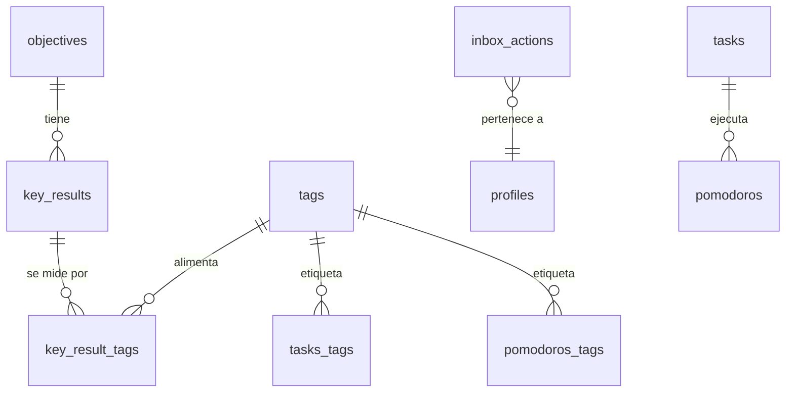
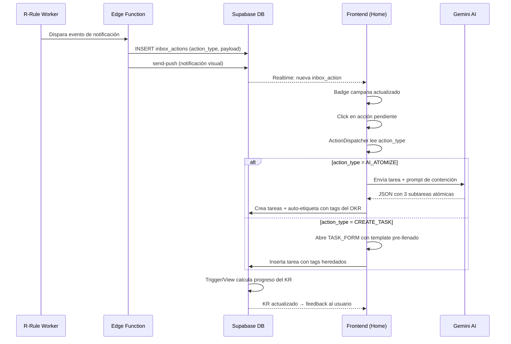

# User Histories, Requirements, Product Design

> Documento consolidado a partir del brainstorming y diseño técnico sobre el sistema de **Tag-Based OKRs** para Yourfocus.
> Fuentes: [brainstorming.md](./brainstorming.md) | [bit_context.md](./bit_context.md)

---

## 1. Contexto y Problema

### 1.1 Perfil del Usuario

- **TDAH**: Alta energía y curiosidad, pero susceptible a saturación por hiperinformación.
- **Hiperproductividad como trampa**: Tendencia a diseñar sistemas perfectos en lugar de ejecutar tareas sencillas.
- **Parálisis por análisis**: Ver muchas notificaciones/tareas equivale a ver ninguna.

### 1.2 Problema Central

El usuario necesita un sistema que:

1. **Reduzca la fricción cognitiva** — No obligar a clasificar antes de actuar.
2. **Fuerce la ejecución atómica** — Impedir tareas mayores a 25 minutos (1 Pomodoro).
3. **Mida el progreso automáticamente** — Sin mantenimiento manual de métricas.
4. **Persista las acciones pendientes** — Que las notificaciones no se pierdan.

---

## 2. Filosofía y Marco Teórico

### 2.1 Kaizen — Mejora Continua del 1%

- **Crecimiento exponencial**: Cada día medir un incremento de al menos 1% sobre el día anterior.
- **Fórmula del progreso**:
  ```
  Progreso % = (Total_Pomodoros_Hoy / Total_Pomodoros_Ayer) - 1
  Si resultado ≥ 0.01 → Día exitoso
  ```

### 2.2 Hoshin Kanri — Alineación Estratégica

- Cascada desde la **visión estratégica** hasta la **ejecución diaria**.
- Los objetivos de alto nivel se desglosan hasta tareas atómicas de 25 min.

### 2.3 Tags sobre Foreign Keys

- **Decisión clave**: Usar etiquetas (Tags) en lugar de relaciones rígidas (FK).
- **Razón**: Las FK obligan a clasificar antes de actuar (alto esfuerzo cognitivo). Los tags permiten "lanzar" ideas y que el sistema las organice después.
- Una tarea puede pertenecer a múltiples objetivos/contextos simplemente añadiendo tags.

---

## 3. Las 3 Dimensiones de Datos

Yourfocus mide el comportamiento del usuario a través de tres entidades ya existentes:

| Dimensión        | Entidad            | Qué Mide                    |
| ---------------- | ------------------ | --------------------------- |
| **Tiempo**       | `pomodoros`        | La energía invertida        |
| **Ejecución**    | `tasks`            | La agencia y el avance real |
| **Conocimiento** | Notas Zettelkasten | La curiosidad y retención   |

---

## 4. Ontología de Métricas — Cualidades Humanas Cuantificadas

El cruce de las 3 dimensiones permite medir cualidades abstractas con datos concretos:

| Cualidad        | Dimensión Principal         | `metric_type`         | Lógica de Cálculo                                                 |
| --------------- | --------------------------- | --------------------- | ----------------------------------------------------------------- |
| **Enfoque**     | Tiempo                      | `intensity_ratio`     | (Tiempo real enfocado) / (Tiempo esperado) × (1 - Interrupciones) |
| **Agencia**     | Ejecución                   | `completion_velocity` | Tiempo desde `to_do` hasta `done`                                 |
| **Curiosidad**  | Conocimiento                | `link_density`        | Cantidad de backlinks generados por nota nueva                    |
| **Interés**     | Mixta (Tiempo+Conocimiento) | `retention_index`     | Pomodoros vinculados a una misma Nota/Tag                         |
| **Competencia** | Ejecución + Conocimiento    | `competence_score`    | Tareas completadas que generan notas Zettelkasten                 |
| **Lucidez**     | Tiempo + Conocimiento       | `flow_state_score`    | Pomodoros ininterrumpidos + Notas creadas post-sesión             |

---

## 5. Requerimientos Funcionales

### RF-01: OKRs Impulsados por Tags (Tag-Driven KRs)

> Los Key Results se miden automáticamente interceptando las etiquetas usadas en el día a día.

- Un **Objective** tiene múltiples **Key Results**.
- Cada Key Result se alimenta de **múltiples tags** con **pesos diferenciados**.
  - Ej: `#deep-work` peso `2.0`, `#admin` peso `0.5`.
- **Fórmula del incremento diario:**
  ```
  Progreso = Σ (Métrica_Base_tag × Peso_tag)
  ```

### RF-02: Inbox de Acciones (Anti-Parálisis)

> Una tabla tipo Pila (Stack) donde solo se muestra la acción de mayor prioridad.

- Las notificaciones recurrentes (R-Rule) generan ítems en el Inbox.
- Los ítems **no desaparecen** hasta que el usuario interactúe: completar, delegar o posponer.
- Cada acción tiene un `action_type` y un `action_payload` (JSON) que determina qué modal abrir.

**Tipos de acción:**
| `action_type` | Descripción | Modal que abre |
|----------------|--------------------------------------|----------------------|
| `CREATE_TASK` | Crear tarea desde template | `TASK_TEMPLATE` |
| `REVIEW_NOTE` | Repasar una nota Zettelkasten | `NOTE_REVIEW` |
| `AI_ATOMIZE` | Desglosar tarea grande con IA | `AI_ATOMIZER` |

### RF-03: Atomización Forzada con IA

> Si una tarea supera 1 Pomodoro (25 min), el sistema bloquea e invoca a la IA para desglosarla.

- **Prompt de contención:**

  > _"Actúa como un Coach de Productividad experto en TDAH. El usuario sufre de hiperinformación. Toma la tarea '[USER_INPUT]' y desglosarla estrictamente en 3 pasos de EXACTAMENTE un pomodoro (25 min) cada uno. Prohibido sugerir investigaciones largas o tareas ambiguas. Cada subtarea debe empezar con un verbo de acción física (Escribir, Programar, Leer, Mover). Devuelve solo JSON: `{ tasks: [{ title: string, estimated_pomodoros: 1 }] }`."_

- Las subtareas generadas **heredan automáticamente** los tags del OKR padre (ej: `#enfoque`).

### RF-04: Notificaciones Persistentes con Links Internos

> Cada notificación incluye un `action_payload` que permite abrir modales de acción directamente.

- **Icono de campana**: Badge con conteo de `inbox_actions` donde `status = 'pending'`.
- **Deep Linking**: Al hacer clic, el payload se pasa al `ActionDispatcher` para montar el modal correcto.
- **Suscripción en tiempo real** a la tabla `inbox_actions` vía Supabase Realtime.

### RF-05: Dashboard del 1% (Feedback Inmediato)

> Al terminar un pomodoro, el sistema notifica el progreso del KR asociado.

- Ej: _"¡Acción completada! Has sumado un 0.4% a tu KR de Enfoque Lúcido hoy."_
- Posibilidad de visualizar las 7 cualidades en un **Radar Chart**.

---

## 6. Diseño de Datos (Evolución del Schema)

> Extensiones propuestas al schema existente de Yourfocus (ver [PROJECT_CONTEXT.md](../../../../PROJECT_CONTEXT.md)).

### 6.1 Tabla `objectives`

```sql
CREATE TABLE IF NOT EXISTS "public"."objectives" (
    "id" uuid DEFAULT gen_random_uuid() PRIMARY KEY,
    "user_id" uuid NOT NULL REFERENCES auth.users(id) ON DELETE CASCADE,
    "title" text NOT NULL,       -- Ej: "Dominar el Enfoque Lúcido"
    "description" text,
    "created_at" timestamptz DEFAULT now()
);
```

### 6.2 Tabla `key_results`

```sql
CREATE TABLE IF NOT EXISTS "public"."key_results" (
    "id" uuid DEFAULT gen_random_uuid() PRIMARY KEY,
    "objective_id" uuid REFERENCES public.objectives(id) ON DELETE CASCADE,
    "target_value" float DEFAULT 100.0,
    "current_value" float DEFAULT 0.0,
    "metric_type" metric_category NOT NULL, -- ENUM definido abajo
    "created_at" timestamptz DEFAULT now()
);
```

### 6.3 Tabla `key_result_tags` (Relación M:N con pesos)

```sql
CREATE TABLE IF NOT EXISTS "public"."key_result_tags" (
    "id" uuid DEFAULT gen_random_uuid() PRIMARY KEY,
    "key_result_id" uuid REFERENCES public.key_results(id) ON DELETE CASCADE,
    "tag_id" bigint REFERENCES public.tags(id) ON DELETE CASCADE,
    "weight" float DEFAULT 1.0,  -- #deep-work vale 2.0, #admin vale 0.5
    UNIQUE("key_result_id", "tag_id")
);
```

### 6.4 Enum `metric_category`

```sql
CREATE TYPE metric_category AS ENUM (
  'COUNT_ATOMIC',        -- Cuenta simple (1 pomodoro = 1 unidad)
  'TIME_INVESTMENT',     -- Suma de minutos reales
  'KNOWLEDGE_DENSITY',   -- Relación Notas/Tareas (Zettelkasten)
  'VELOCITY_STREAK',     -- Consistencia de días seguidos (para el 1%)
  'INTERSECTION_SCORE'   -- El KR depende de 2 o 3 entidades a la vez
);
```

### 6.5 Tabla `inbox_actions`

```sql
CREATE TABLE IF NOT EXISTS "public"."inbox_actions" (
    "id" uuid DEFAULT gen_random_uuid() PRIMARY KEY,
    "user_id" uuid NOT NULL REFERENCES auth.users(id) ON DELETE CASCADE,
    "title" text NOT NULL,
    "description" text,
    "action_type" text NOT NULL,               -- 'CREATE_TASK', 'REVIEW_NOTE', 'AI_ATOMIZE'
    "action_payload" jsonb DEFAULT '{}',       -- Datos para el Modal
    "status" text DEFAULT 'pending'
        CHECK (status IN ('pending', 'completed', 'dismissed')),
    "priority" int DEFAULT 1,
    "created_at" timestamptz DEFAULT now(),
    "completed_at" timestamptz
);

-- RLS
ALTER TABLE "public"."inbox_actions" ENABLE ROW LEVEL SECURITY;
CREATE POLICY "Users can manage own inbox actions" ON "public"."inbox_actions"
    FOR ALL TO authenticated USING (auth.uid() = user_id);
```

### 6.6 Diagrama de Relaciones (Propuesto)



---

## 7. Diseño de Componentes (Frontend)

### 7.1 Action Dispatcher

El patrón central del frontend: un router que lee el `action_payload` de una `inbox_action` y monta el modal correspondiente.

```typescript
// types/actions.ts
export interface ActionPayload {
  modalType: "TASK_TEMPLATE" | "AI_ATOMIZER" | "NOTE_REVIEW";
  data: {
    templateId?: string;
    taskId?: string;
    suggestedTags?: string[]; // Ej: ["#enfoque", "#1percent"]
  };
}

// Lógica del dispatcher
const handleNotificationClick = (action: InboxAction) => {
  const payload = action.action_payload as ActionPayload;

  switch (payload.modalType) {
    case "AI_ATOMIZER":
      uiStore.openModal("ATOMIZER", { taskId: payload.data.taskId });
      break;
    case "TASK_TEMPLATE":
      uiStore.openModal("TASK_FORM", {
        templateId: payload.data.templateId,
        tags: payload.data.suggestedTags,
      });
      break;
    case "NOTE_REVIEW":
      uiStore.openModal("NOTE_VIEWER", {
        /* ... */
      });
      break;
  }
};
```

### 7.2 Notification Center (Home)

- **Icono de campana** con badge rojo → conteo de `pending`.
- **Lista de acciones**: Cards que renderizan `inbox_actions` pendientes.
- **Suscripción Realtime** a `inbox_actions` para actualización instantánea.

### 7.3 AI Atomizer Modal

- Recibe `taskId` del payload.
- Envía el título de la tarea al prompt de contención.
- Renderiza las subtareas propuestas por la IA.
- Botón "Aceptar" crea los pomodoros/tareas vinculados con auto-etiquetado.

---

## 8. Flujo de Integración (End-to-End)



---

## 9. Principios de Diseño para TDAH

| #   | Principio                     | Implementación                                                 |
| --- | ----------------------------- | -------------------------------------------------------------- |
| 1   | **Decisión única**            | Inbox muestra solo la acción de mayor prioridad                |
| 2   | **Atomización forzada**       | IA bloquea tareas > 25 min y las desglosa                      |
| 3   | **Tags sobre jerarquías**     | Sin clasificación previa; lanza y el sistema organiza          |
| 4   | **Feedback inmediato**        | Notificación de progreso al completar un pomodoro              |
| 5   | **Gamificación del filtro**   | Pesos en tags permiten combos que suben el puntaje más rápido  |
| 6   | **Córtex prefrontal externo** | La IA actúa como filtro de realidad contra la hiperinformación |

---

## 10. Clasificación de esta Actividad

- **Tipo**: `#Arquitectura-de-Sistemas` / `#Ontología-de-Datos`
- **Fase**: Diseño Estructural (Conceptual y Lógico) — Pre-Implementación
- **Categoría**: Diseño de Producto / R&D
- **Estado**: Ideación Madura → Lista para Planificación de Implementación
